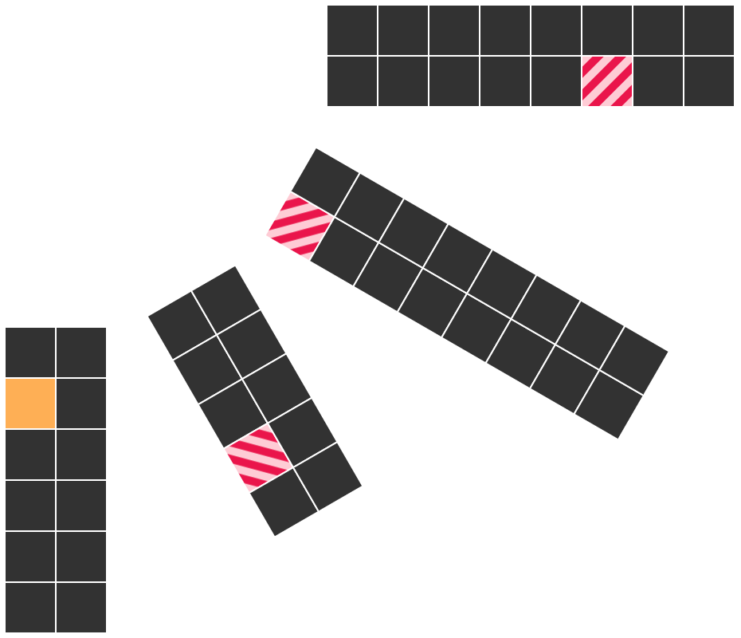

# seat-planner
This package contains a web component, `seat-booking`, which allows for seats to be booked.

## Example usage
The simplest usage of the component is as follows:
```html
<html>
  <head>
    <link rel="stylesheet" href="style.css"/>
  </head>
  <body>
    <seat-booking
      data-layout="6,5,8,8"
      data-occupied="1,15,22,43"
      data-selected-seat="1"
    ></seat-booking>
    <script src="dist/bundle.js"></script>
  </body>
</html>
```

This creates a layout looking like this: 

The `data-layout`-attribute in the example says that four table rows should be created: one with 6 tables, one with 5, one with 8 and the last one also with 8. 
The tables are laid out evenly from pointing to the bottom to the right. The format of the attribute is comma separated integers, each saying how many tables are in each table row.

The `data-occupied`-attribute says which seats are occupied and cannot be selected. The attribute is in the same format as `data-layout` and are the same IDs as is returned by the web component.

The `data-selected-seat` is set automatically when a seat is selected and represents the ID of the seat which is selected. In the picture above, it's the orange seat with ID `1`.

## Events
To detect when a seat has been selected, the `seat-selected` event should be used on the web component itself.
This can be done like this:
```javascript
const booking = document.querySelector("seat-booking");
booking.addEventListener("seat-selected", function(e) {
  console.log("Selected seat: %s", e.detail.seatId);
});
```